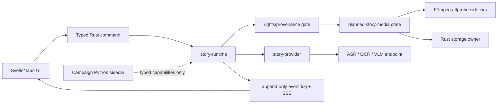

# Video material pipeline — system design

Status: deferred; not part of the current story-writing release
Date: 2026-07-27

This is a non-binding reference design. The current release does not download
video, extract video material, package FFmpeg, create media contracts or expose
media UI. Reactivation requires a new scope decision and fresh G0 approval.

## Chosen stack

| Layer | Choice | Ownership |
| --- | --- | --- |
| Desktop | Tauri 2, Svelte 5, Vite, TypeScript | UI invokes typed Rust commands |
| Async runtime | Tokio and existing `story-runtime` | jobs, cancellation, durable events |
| Media tools | pinned FFmpeg + ffprobe sidecars | Rust supervised processes |
| Media metadata | `serde`, `serde_json` | versioned Rust domain types |
| Hashing | SHA-256 | source identity, deduplication, provenance |
| Storage | SQLite via existing Rust storage owner plus content-addressed files | metadata and artifacts |
| Network | `reqwest` with rustls through `story-provider` | ASR, OCR/VLM providers |
| Errors | typed `thiserror` errors | stable failure codes, safe diagnostics |
| Optional language ID | `fasttext-pure-rs` after ASR | no native fastText dependency |

Rust toolchain baseline is 1.96 / edition 2021 to stay compatible with the
referenced nanocodex and short-video workbench. Dependency versions must be
pinned by `Cargo.lock`; bundled binary versions and hashes must be recorded in a
third-party manifest.

## Component boundary

`story-media` owns media validation, process supervision, extraction algorithms
and derivation metadata. It does not own job orchestration, credentials or an
independent database. The existing owners remain:

- `story-runtime`: lifecycle, cancellation, replay and event ordering;
- `story-provider`: credentials, retries, model calls, policy and budget;
- Rust storage owner: SQLite transactions and artifact persistence;
- `story-core`: shared identifiers and versioned cross-component contracts.

## Pipeline

1. `ImportLocalMedia` accepts a canonical local path plus rights/provenance.
2. Rust enforces file, size, duration, codec and workspace-path policy.
3. The source is hashed and registered as an immutable artifact.
4. ffprobe creates `media-probe/v1`; L0 rejects empty, unparseable or
   stream-less inputs and validates duration/dimensions.
5. FFmpeg extracts 16 kHz mono audio. The provider adapter chooses the final
   lossless or compressed transport format and segments requests when needed.
6. FFmpeg extracts JPEG keyframes using scene change `gt(scene,0.4)`. If too
   few frames result, uniform time sampling fills the set. Frames are
   SHA-256-deduplicated and evenly reduced to at most 60.
7. `story-provider` optionally requests ASR, OCR and vision analysis.
8. Rust writes `material-bundle/v1` and emits a durable terminal event.

Every derived artifact records source hash, parent artifact, command parameter
set, FFmpeg version, extractor version, creation time and rights reference.

## Process supervision

Production code adapts the reference implementations but uses
`tokio::process::Command`, not their blocking `std::process::Command` path:

- executable paths are resolved from an application-managed tool manifest;
- arguments are passed as argv without a command shell;
- stdout/stderr are bounded and secrets are redacted;
- timeout or cancellation kills and reaps the child process;
- output is written to a job temp directory, validated, then atomically moved;
- startup checks expose binary availability and version to diagnostics.

## Contracts and events

Planned schemas:

- `media-source/v1`
- `media-probe/v1`
- `material-bundle/v1`
- `media-segment/v1`

Planned event payloads reuse the existing event envelope:

- `material.imported`
- `media.probe.completed`
- `media.audio.extracted`
- `media.keyframes.extracted`
- `media.transcript.completed`
- `media.bundle.ready`
- `media.pipeline.failed`

Consumers deduplicate by event ID. A lost SSE connection is not a failed job.

## Decisions not carried over

- The nanocodex crate's private SQLite store is not copied; it would duplicate
  product storage ownership.
- Its blocking HTTP/process calls are reference behavior, not the production
  concurrency model.
- Its optional Temporal feature is not enabled because `story-runtime` and the
  Campaign sidecar already own orchestration.
- The Python downloader's `aiohttp`, `aiosqlite` and `imageio-ffmpeg` stack is
  not a production trust boundary. Its timeout, kill/reap, bounded diagnostics
  and partial-file cleanup behavior is adopted in Rust.
- Platform download adapters are a later, separately reviewed capability.

## Delivery slices

1. Contracts and fixture-based probe validation.
2. Supervised FFmpeg toolchain and local import.
3. Audio/keyframe extraction and artifact persistence.
4. Provider-backed ASR/OCR/VLM.
5. Tauri material-library UI and resumable progress.
